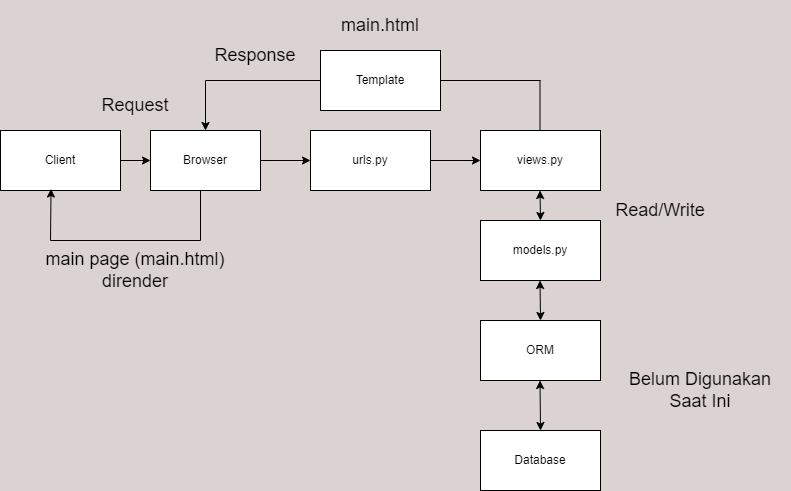
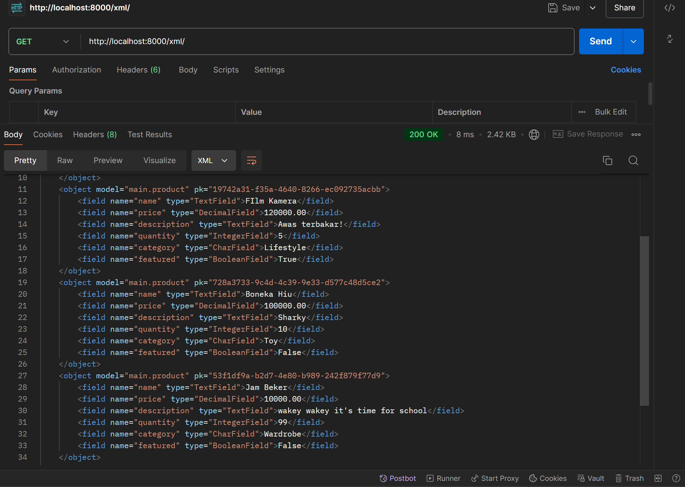
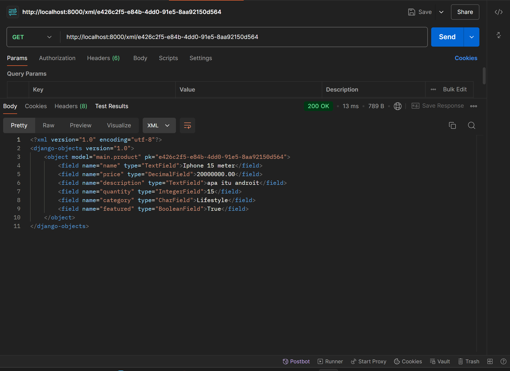
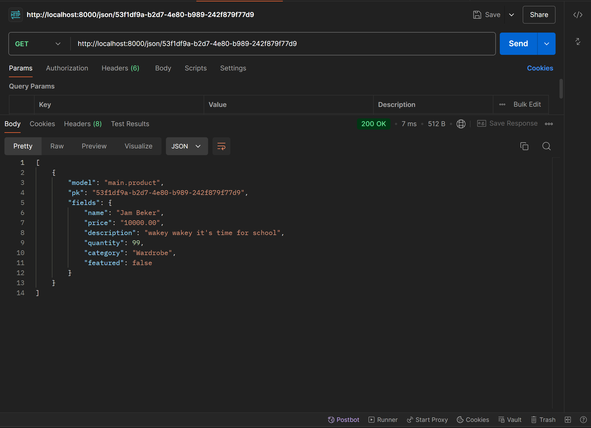

# Morehub

## [Visit Morehub Right Now!](http://krisna-putra-morehub.pbp.cs.ui.ac.id/)

### Morehub.com, a Platform-Based Programming project, made by:
- Nama: Krisna Putra Purnomo
- NPM: 2306228756
- Kelas: PBP E

### Redirect 
- [Tugas 2](#pertanyaan-tugas-2)
- [Tugas 3](#pertanyaan-tugas-3)
- [Tugas 4](#pertanyaan-tugas-4)
- [Tugas 5](#pertanyaan-tugas-5)
- [Tugas 6](#pertanyaan-tugas-6)

### Pertanyaan Tugas 2

1. Jelaskan bagaimana cara kamu mengimplementasikan _checklist_ di atas secara _step-by-step_ (bukan hanya sekadar mengikuti tutorial).

    **JAWAB**:

    a. Pastikan setup telah selesai disiapkan, termasuk django telah terinstall, dan _virtual environment_ dapat berjalan dengan baik.

    b. Pertama-tama, saya membuat requirements.txt yang berisi dependencies proyek Django yang akan saya buat, berdasarkan dependencies pada sesi tutorial.

    c. Jika sekiranya tidak ada masalah, selanjutnya saya membuat proyek Django dengan perintah `django-admin startproject Morehub .` dimana Morehub adalah nama aplikasi e-dagang saya.

    d. Selanjutnya, saya membuat aplikasi `main` dengan menggunakan perintah `python manage.py startapp main`.

    e. Saat aplikasi `main` sudah dibuat, saya membuat model `Product`  di `models.py` pada folder `main` dengan atribut sebagai berikut: 

    ```python
        from django.db import models

        class Product(models.Model):
            name = models.TextField()
            price = models.DecimalField(max_digits=10, decimal_places=2)
            description = models.TextField()
            quantity = models.IntegerField()
            category = models.CharField(max_length=100)
            featured = models.BooleanField()
    ```
    Namun, saat masa Tugas 2 ini, atribut model di atas masih _subject to change_, karena proyeknya belum dikerjakan. Namun, saya sudah melakukan migrasi model ke dalam basis data lokal.

    f. Setelah itu, buat folder baru di dalam aplikasi `main` bernama `templates` berisi `main.html` yang dapat menampilkan data dari model `Product`.

    g. Kemudian, saya mengintegrasikan komponen MVT dengan membuat fungsi `show_main` di `views.py` yang akan mengembalikan _response_ berupa _template_ HTML yang menampilkan nama aplikasi dan nama serta kelas saya.

    ```python
        from django.shortcuts import render

        def show_main(request):
            context = {
                'name': 'Film kamera analog',
                'price': '120000',
                'description': 'awas terbakar',
                'quantity': '10',
                'category': 'Lifestyle',
                'featured': True
            }

            return render(request, "main.html", context)
    ```

    h. Setelah itu, saya membuat routing URL aplikasi `main` untuk mengatur rute URL spesifik untuk fitur-fitur dalam aplikasi tersebut. 

    ```python
        from django.urls import path
        from main.views import show_main

        app_name = 'main'

        urlpatterns = [
            path('', show_main, name='show_main'),
        ]
    ```

    i. Kemudian, saya membuat routing di tingkat proyek agar proyek saya dapat menjalankan aplikasi `main` dengan menambahkan path `/`ke `urls.py` proyek.

    ```python
        from django.contrib import admin
        from django.urls import path, include

        urlpatterns = [
            path('', include('main.urls')),
            path('admin/', admin.site.urls),
        ]
    ```

2. Buatlah bagan yang berisi request client ke web aplikasi berbasis Django beserta responnya dan jelaskan pada bagan tersebut kaitan antara `urls.py`, `views.py`, `models.py`, dan berkas `html`.

    **JAWAB**:

    

    a. Client mengirimkan _request_ halaman utama ke browser yang diarahkan kepada URL routing (`urls.py`) yang berada di tingkat proyek.

    b. _Request_ tersebut diterima dan kemudian fungsi show_main() di `views.py` dipanggil.

    c. Setelah itu, fungsi show_main() yang sudah memiliki pre-defined model (context), dapat berinteraksi dengan ORM maupun basis data (melakukan operasi _read_/_write_) untuk mengakses/mengubah data yang nantinya akan ditampilkan. Namun, pada saat ini saya mengerjakan tugas ini, belum ada implementasi ORM/basis data.

    d. Kemudian, pemanggilan fungsi show_main() pada `views.py` yang sudah berisi data akan diteruskan ke `templates/main.html`. 

    e. Jika tidak terjadi error, `main.html` akan dikirim kembali ke browser sebagai _response_ sebagai halaman utama yang di-_request_ client.

    f. Halaman utama yang sudah berisi `main.html` ditampilkan di browser Client.

3. Jelaskan fungsi `git` dalam pengembangan perangkat lunak!

    **JAWAB**:

    a. **Version Control**:
    Git melacak setiap perubahan kode, sehingga memungkinkan developer riwayat versi pengembangan dan memungkinkan untuk beralih ke versi sebelumnya, contohnya menggunakan command `commit`, `reset`, dan `checkout`.

    b. **Collaboration**:
    Git memungkinkan kolaborasi antar developer yang bekerja pada suatu projek yang sama. Dengan `branching` dan `merging`, para developer dapat bekerjasama tanpa mengganggu pekerjaan satu sama lain.

    c. **Deployment**:
    Git memungkinkan developer untuk melakukan _deployment_ ke _production server_ secara mudah melalui command `push` untuk mengirim versi terbaru dan `pull` untuk menerima versi terbaru.

4. Menurut Anda, dari semua framework yang ada, mengapa framework Django dijadikan permulaan pembelajaran pengembangan perangkat lunak?

    **JAWAB**:

    a. **_Built-in Features_**:
    Dengan fitur bawaan yang _beginner-friendly_ seperti pengelolaan basis data menggunakan ORM, pemula diharapkan dapat lebih mudah memahami konsep dasar pengembangan perangkat lunak. Bahkan, django juga memiliki fitur keamanan bawaan yang dapat mencegah serangan siber seperti SQL Injection dan MitM. Namun, _developer_ tetap harus mempelajari dan mengimplementasikan keamanan siber lebih lanjut untuk membuat proyek yang lebih serius.

    b. **Struktur**:
    Pola MVT (Model-View-Template) yang dengan jelas memisahkan logika _back-end_ dan _front-end_, memudahkan pemula untuk memahami organisasi dan struktur web, serta membantu pemula dalam pengembangan web yang lebih kompleks.
    
    c. **Skalabilitas**:
    Kebanyakan proyek yang menggunakan django merupakan proyek web besar dan kompleks yang berkelanjutan. Django dirancang sedemikian rupa sehingga proses CI/CD dapat dilakukan dengan mudah. Dengan demikian, pemula juga dapat belajar cara me-_maintain_ suatu perangkat lunak yang terus berkembang dan berkelanjutan.

    d. **_Built-in_ ORM**:
    Django secara otomatis memberikan API abstraksi basis data (ORM) yang memungkinkan user untuk membuat, menerima, mengupdate, dan menghapus objek. Dengan demikian, pemula tidak perlu berhadapan langsung dengan _raw_ SQL. 

5. Mengapa model pada Django disebut sebagai _ORM_?

    **JAWAB**:

    Model pada Django disebut ORM karena mereka menghubungkan struktur objek dalam kode python dengan tabel-tabel dalam database relasional, seperti halnya pada SQL.

### Pertanyaan Tugas 3

1. Jelaskan mengapa kita memerlukan _data delivery_ dalam pengimplementasian sebuah platform?

    **JAWAB**:

    _Data delivery_ dibutuhkan ketika kita ingin mengirimkan data dari satu _stack_ ke _stack_ lainnya. Hal tersebut sangat krusial di banyak aplikasi web modern yang membutuhkan _update_ data secara _real-time_. Selain itu, _data delivery_ yang efisien merupakan salah kunci dalam performa UX (_User Experience_). _Data delivery_ yang baik membuat _user_ menerima konten dengan cepat dan responsif, menciptakan pengalaman yang lebih baik dan menarik bagi _user_. Sebaliknya, _data delivery_ yang buruk dapat membuat waktu _loading_ menjadi lambat dan dapat membuat _user_ kesal.

2. Menurutmu, mana yang lebih baik antara XML dan JSON? Mengapa JSON lebih populer dibandingkan XML?

    **JAWAB**:

    Menurut saya, JSON lebih baik dari XML. Misalnya, dari segi sintaks, JSON lebih pendek dan simpel. Selain itu, JSON dapat di-_parse_ menggunakan fungsi JavaScript biasa, sedangkan XML harus di-_parse_ menggunakan XML _parser_. Alasan JSON lebih populer di dunia _web development_ dibandingkan XML adalah karena JSON banyak digunakan untuk pertukaran data, khususnya bersama JavaScript asinkronus (AJAX) dan REST API, teknik pemrograman dan API yang paling umum digunakan.

3. Jelaskan fungsi dari method `is_valid()` pada form Django dan mengapa kita membutuhkan method tersebut?

    **JAWAB**:

    Fungsi `form.is_valid()` pada Django berfungsi untuk memvalidasi input, berdasarkan tipe data (Misal IntegerField, TextField), _constraints_ (Misal, required=True, max_length), atau _custom validator_. Method ini akan mengembalikan nilai Boolean, yang berfungsi sebagai _error handler_ yang akan me-_return_ False jika validasi gagal dan menampilkan atribut `form.errors`, dan mengembalikan True jika semua validasi berhasil.

4. Mengapa kita membutuhkan `csrf_token` saat membuat form di Django? Apa yang dapat terjadi jika kita tidak menambahkan `csrf_token` pada form Django? Bagaimana hal tersebut dapat dimanfaatkan oleh penyerang?

    **JAWAB**:

    Kita membutuhkan `csrf_token` untuk memberi perlindungan terhadap serangan siber bertipe CSRF (Cross-Site Request Forgery), dimana penyerang mencoba memaksa _user_ yang telah login untuk mengirimkan _request_ yang tidak diinginkan ke aplikasi web tanpa sepengetahuan mereka. Jika kita tidak menambahkan token tersebut pada form Django, aplikasi web kita rentan terhadap serangan CSRF. Penyerang dapat membuat pengguna secara tidak sadar melakukan tindakan berbahaya, seperti mengubah kata sandi, melakukan transfer dana, dan tindakan lainnya hanya dengan mengunjungi situs berbahaya. Hal tersebut dapat dimanfaatkan oleh penyerang dengan mengirimkan permintaan ke aplikasi Django di mana pengguna sudah login. Contohnya, saat _user_ sedang login di aplikasi bank online, lalu membuka halaman berbahaya di tab lain, halaman tersebut bisa mengirim permintaan POST ke aplikasi bank untuk mentransfer uang ke rekening penyerang, karena cookie sesi pengguna akan otomatis dikirim bersama permintaan. Tanpa `csrf_token`, _server_ tidak bisa mendeteksi bahwa permintaan tersebut tidak berasal dari pengguna.

5. Jelaskan bagaimana cara kamu mengimplementasikan _checklist_ di atas secara _step-by-step_ (bukan hanya sekadar mengikuti tutorial).

    **JAWAB**:

    a. Setelah membuat template dasar `base.html` di _root_ folder dan mengubah _Primary Key_ dari Integer menjadi UUID untuk menangani **IDOR** _vulnerability_, saya membuat file `forms.py` pada direktori `main` yang nantinya akan menjadi struktur form yang menerima produk baru.

    ```python
        from django.forms import ModelForm
        from main.models import Product

        class ProductForm(ModelForm):
            class Meta:
                model = Product
                fields = ['name', 'price', 'description', 'quantity', 'category', 'featured']
    ```

    b. Kemudian, saya menambahkan _import_ `redirect` dari `django.shortcuts` pada `views.py` dan tentunya saya juga meng-_import_  `ProductForm` dari `forms.py`.

    c. Masih di file `views.py`, saya menambahkan fungsi dengan parameter `request` baru untuk mengirim _form_ dan menambahkan `Product` jika _form_ yang diisi valid (dicek dengan method `is_valid()`) melalui `request.POST`.

    ```python
        def create_product(request):
        form = ProductForm(request.POST or None)

        if form.is_valid():
            form.save()
            return redirect('main:show_main')
        
        context = {'form': form}
        return render(request, 'create_product.html', context)
    ```

    d. Setelah itu, pada fungsi `show_main()` di `views.py`, saya menambahkan fungsi `Product.objects.all()` yang di-_assign_ ke `products` untuk mengambil seluruh objek `Product` dari basis data.

    ```python
        def show_main(request):
        products = Product.objects.all()
        context = {
            'name': 'Panci',
            'price': '5000',
            'description': 'Panci buat mentung orang',
            'quantity': '10',
            'category': 'Dapur',
            'featured': True,
            'products': products
        }

        return render(request, "main.html", context)
    ```
    Objek yang saya buat di atas hanya contoh.

    e. Kemudian, saya meng-_import_ fungsi `create_product` ke `urls.py` agar saya dapat menambahkannya ke `urlpatterns`.

    f. Setelah itu, saya membuat file HTML baru `create_product.html` sebagai template form yang akan mengirim _request_ ke _view_ `create_product(request)`. Saya juga menampilkan data `product` dalam bentuk tabel dan tombol "Add Product" yang akan _redirect_ ke halaman _form_.

    g. Kemudian, saya akan membuat empat buah fungsi pada `views.py` di `main` yang masing-masing akan mengembalikan data dalam bentuk JSON, XML, JSON berdasarkan ID, dan XML berdasarkan ID. Namun sebelum itu, saya harus menambahkan _import_ `HttpResponse` untuk merespon HTTP dan `Serializer` untuk menerjemahkan objek model menjadi format lain (XML dan JSON).

    h. Setelah itu, saya membuat masing-masing fungsi yang akan mengembalikan data sesuai yang saya jelaskan pada langkah sebelumnya.

    ```python 
        def show_xml(request):
        data = Product.objects.all()
        return HttpResponse(serializers.serialize("xml", data), content_type="application/xml")

        def show_json(request):
            data = Product.objects.all()
            return HttpResponse(serializers.serialize("json", data), content_type="application/json")

        def show_xml_by_id(request, id):
            data = Product.objects.filter(pk=id)
            return HttpResponse(serializers.serialize("xml", data), content_type="application/xml")

        def show_json_by_id(request, id):
            data = Product.objects.filter(pk=id)
            return HttpResponse(serializers.serialize("json", data), content_type="application/json")
    ```

    Perhatikan bahwa `content_type` disesuaikan dengan bentuk data yang akan dikembalikan.

    i. Kemudian, saya membuat _routing_ URL untuk masing-masing `views` yang telah saya tambahkan pada langkah sebelumnya. _Routing_ tersebut dikelola pada `urls.py` di `main`, yang akan meng-_handle_ semua pola URL yang akan mengembalikan data yang diinginkan.

    ```python
        from django.urls import path
        from main.views import show_main, create_product, show_xml, show_json, show_xml_by_id, show_json_by_id

        app_name = 'main'

        urlpatterns = [
            path('', show_main, name='show_main'),
            path('create-product', create_product, name='create_product'),
            path('xml/', show_xml, name='show_xml'),
            path('json/', show_json, name='show_json'),
            path('xml/<str:id>', show_xml_by_id, name='show_xml_by_id'),
            path('json/<str:id>', show_json_by_id, name='show_json_by_id'),
        ]
    ```

    Perhatikan bahwa saya meng-_import_ terlebih dahulu semua fungsi yang berada di `views.py` untuk dapat melakukan _call_ pada setiap pola URL yang didefinisikan.

6.  Mengakses keempat URL di poin 2 menggunakan Postman, membuat _screenshot_ dari hasil akses URL pada Postman, dan menambahkannya ke dalam `README.md`.

    a. `show_xml()`

    

    b. `show_json()`

    

    c. `show_xml_by_id()`

    

    d. `show_json_by_id`

    


### Pertanyaan Tugas 4

1. Apa perbedaan antara `HttpResponseRedirect()` dan `redirect()`

    **JAWAB**:

    Fungsi `HttpResponseRedirect()` berfungsi untuk me-_return_ status HTTP 302, yang menunjukkan bahwa browser harus mengarahkan ulang ke URL yang diberikan. Parameter fungsinya dapat berupa URL tujuan secara langsung, ataupun _reference_ dari URL _view name_ atau bahkan _model instance_ menggunakan method reverse() seperti yang diajarkan di tutorial untuk menghindari _hardcoding_, karena django menggunakan sistem _named URL routing_. Di sisi lain, fungsi `redirect()` lebih fleksibel karena selain dapat menerima URL secara langsung, fungsi ini bisa menerima _view name_ atau sebuah _model instance_. Django akan otomatis mengonversi view name dan model instance menjadi URL. 

2. Jelaskan cara kerja penghubungan model `Product` dengan `User`!

    **JAWAB**:

    Pertama, import `User` pada `models.py` untuk keperluan autorisasi model. Kemudian pada class model yang dibuat, hubungkan satu objek model (dalam hal ini `Product`) dengan satu user menggunakan ForeignKey. Dengan demikian, sebuah Product sekarang sudah terasosisasikan dengan seorang user. Namun, method untuk membuat objek (`Product`) pada `views.py` juga harus di-_adjust_ agar hanya user yang terautorisasi yang bersangkutan yang hanya dapat membuat objek baru.

3. Apa perbedaan antara _authentication_ dan _authorization_, apakah yang dilakukan saat pengguna login? Jelaskan bagaimana Django mengimplementasikan kedua konsep tersebut.

    **JAWAB**:

    _Authentication_ adalah proses verifikasi data pengguna, sedangkan _authorization_ adalah proses untuk memeriksa hak akses pengguna setelah mereka terautentikasi. Saat pengguna login dan memasukkan kredensial, sistem akan mencocokkan kredensial tersebut dengan yang terdapat di basis data. Jika sesuai, sistem akan melakukan proses _authorization_ untuk memastikan apakah pengguna tersebut diizinkan untuk mengakses halaman atau melakukan tindakan tertentu. Implementasi _authentication_ di django menggunakan model `User` bawaan di `django.contrib.auth.models.User` yang menyimpan kredensial pengguna seperti Username dan Password. Ketika pengguna login menggunakan view, django akan memverifikasi kredensial pengguna menggunakan `AuthenticationForm`. Jika valid, django akan menginisiasi _session_ untuk pengguna. Setelah itu, objek user dapat login untuk menyimpan informasi pengguna dalam session, sehingga Django tahu bahwa pengguna ini terautentikasi pada permintaan-permintaan berikutnya. Di sisi lain, untuk implementasi _authorization_, django menggunakan sistem _permissions_ sehingga setiap pengguna memiliki izin bawaan seperti "add", "change", dan "delete" objek. Izin-izin ini dapat diperluas sesuai dengan kebutuhan aplikasi. Selain itu, django juga memiliki beberapa decorator seperti `@login_required` untuk membatasi akses hanya pada pengguna yang terautentikasi, dan `@permission_required` untuk melakukan pengecekan izin spesifik untuk setiap view atau tindakan.

4. Bagaimana Django mengingat pengguna yang telah login? Jelaskan kegunaan lain dari _cookies_ dan apakah semua _cookies_ aman digunakan?

    **JAWAB**:

    Saat pengguna berhasil login, Django membuat session yang disimpan di server, dan memberikan pengguna tersebut sebuah _session cookie_ yang berisi _session ID_. _Session ID_ inilah yang nantinya akan dikirim bersama _request_ pengguna selanjutnya, sehingga _server_ bisa  mengaitkan _request_ tersebut dengan sesi pengguna yang tersimpan di _server_, sehingga pengguna tidak perlu login lagi. Kegunaan lain _cookies_ misalnya untuk menyimpan preferensi pengguna, contohnya  jika pengguna memilih _dark mode_ di suatu situs web, _cookie_ dapat menyimpan informasi ini sehingga pada kunjungan berikutnya situs tetap tampil dalam _dark mode_. Selain itu, _cookies_ juga sering digunakan oleh *Google Analytics* dan _personalized ad_ untuk memungkinkan iklan ditargetkan berdasarkan pelacakan aktivitas pengguna. Terakhir, tidak semua _cookies_ aman digunakan. Hal ini karena cookies dapat disalahgunakan untuk menyimpan informasi sensitif seperti password atau data pribadi yang berisiko tinggi diambil oleh pihak yang tidak berwenang, misalnya _hacker_. Namun, django menyediakan beberapa flag bawaan yang dapat meminimalisir kemungkinan tersebut seperti `Secure`, `HttpOnly`, dan `SameSite`. Selain itu, cookies untuk sesi login sebaiknya memiliki waktu kedaluwarsa yang wajar (tidak terlalu lama) untuk mencegah risiko keamanan.

5. Jelaskan bagaimana cara kamu mengimplementasikan _checklist_ di atas secara _step-by-step_ (bukan hanya sekadar mengikuti tutorial).

    **JAWAB**:

    a. Pertama, pada `views.py` saya menambahkan import dari `django.contrib.auth.forms`, `django.contrib`, dan `django.contrib.auth` untuk kepentingan pembuatan form dan fungsi login dan logout yang akan saya buat.

    ```python
        from django.contrib.auth.forms import UserCreationForm, AuthenticationForm
        from django.contrib import messages
        from django.contrib.auth import authenticate, login, logout
    ```

    b. Masih di file yang sama, saya menambahkan fungsi `register()` seperti berikut

    ```python
        def register(request):
            form = UserCreationForm()

            if request.method == "POST":
                form = UserCreationForm(request.POST)
                if form.is_valid():
                    form.save()
                    messages.success(request, 'Your account has been successfully created!')
                    return redirect('main:login')
            context = {'form':form}
            return render(request, 'register.html', context)
    ```

    Fungsi tersebut digunakan untuk menghasilkan form registrasi secara otomatis dan menghasilkan akun pengguna ketika data di-_submit_ dari form.

    c. Setelah itu, saya membuat file `register.html` yang akan menampilkan form registrasi kepada pengguna yang akan mendaftar.

    d. Setelah itu, kembali ke `views.py`, saya menambahkan import sebagai berikut

    ```python
        import datetime
        from django.http import HttpResponseRedirect
        from django.urls import reverse
    ```

    Import tersebut berguna untuk keperluan penerapan _cookies_.
            
    e. Kemudian, saya menambahkan fungsi `login_user()` yang berfungsi untuk mengautentikasi pengguna yang ingin login. ```python
        def login_user(request):
            if request.method == 'POST':
                form = AuthenticationForm(data=request.POST)

                if form.is_valid():
                    user = form.get_user()
                    login(request, user)
                    response = HttpResponseRedirect(reverse("main:show_main"))
                    response.set_cookie('last_login', str(datetime.datetime.now()))
                    return response

            else:
                form = AuthenticationForm(request)
            context = {'form': form}
            return render(request, 'login.html', context)
    ```

    Fungsi tersebut sudah menerapkan _cookies_ yang akan melihat dan menyimpan kapan terakhir kali pengguna login.

    f. Setelah itu, saya menambahkan potongan kode `'last_login': request.COOKIES['last_login']` ke dalam variabel `context` pada fungsi `show_main(). Potongan kode tersebut-lah yang akan menampilkan kapan terakhir kali pengguna login. Tampilkan sesi terakhir login dengan menampilkan `last_login` di file `main.html`.

    g. Kemudian, saya membuat file `login.html` di `main/templates` sebagai form login akun.

    h. Setelah itu, saya membuat fungsi baru di `views.py` yang berfungsi untuk logout. 

    ```python
        def logout_user(request):
            logout(request)
            response = HttpResponseRedirect(reverse('main:login'))
            response.delete_cookie('last_login')
            return response
    ```

    Jangan lupa untuk menambahkan tombol logout di `main.html` yang mengimplementasikan fungsi logout yang baru saja dibuat.

    i. Kemudian, buka `urls.py`, import semua fungsi yang telah kita buat dan tambahkan semua _path url_ fungsi tersebut ke `urlpatterns`. Sekarang `urlpatterns` saya seperti ini

    ```python
        urlpatterns = [
            path('', show_main, name='show_main'),
            path('create-product', create_product, name='create_product'),
            path('xml/', show_xml, name='show_xml'),
            path('json/', show_json, name='show_json'),
            path('xml/<str:id>', show_xml_by_id, name='show_xml_by_id'),
            path('json/<str:id>', show_json_by_id, name='show_json_by_id'),
            path('register/', register, name='register'),
            path('login/', login_user, name='login'),
            path('logout/', logout_user, name='logout')
        ]
    ```

    j. Terakhir, saya akan kembali ke `views.py` untuk mengimplementasikan _authorization_ agar hanya pengguna yang telah login yang dapat mengakses halaman `main`. Impor _decorator_ `login_required` dari `django.contrib.auth.decorators` dan tambahkan _decorator_ tersebut diatas fungsi `show_main()`.

    k. Untuk menghubungkan `Product` dengan `User`,  saya menambah import `from django.contrib.auth.models import User` pada `models.py`, kemudian menambahkan potongan kode `user = models.ForeignKey(User, on_delete=models.CASCADE)` pada model saya. Untuk cara kerjanya sudah saya jelaskan pada jawaban soal nomor 2.

    l. Setelah itu, saya berpindah ke `views.py` untuk mengubah fungsi `create_product()` menjadi sedemikian rupa

    ```python
        def create_product(request):
            form = ProductForm(request.POST or None)

            if form.is_valid() and request.method == "POST":
                product_entry = form.save(commit=False)
                product_entry.user = request.user
                product_entry.save()
                return redirect('main:show_main')
            
            context = {'form': form}
            return render(request, 'create_product.html', context)
    ```

    m. Setelah itu, saya menampilkan username pengguna yang login pada halaman main dengan mengubah variabel `context` pada fungsi `show_main()` sedemikian rupa

    ```python
        @login_required(login_url='/login')
        def show_main(request):
            products = Product.objects.filter(user=request.user)
            context = {
                'my_name': 'Krisna Putra Purnomo',
                'NPM': '2306228756',
                'class': 'E',
                'name': request.user.username,
                'title': 'Keeps you coming for more!',
                'products': products,
                'last_login': request.COOKIES['last_login']
            }

            return render(request, "main.html", context)
    ```

    n. Setelah menyesuaikan file `main.html` untuk menampilkan nama user yang sedang login, saya melakukan migrasi model dan menetapkan _default value_ untuk _field user_ pada semua baris yang telah dibuat pada basis data.

    o. Terakhir, saya mengikuti tutorial dengan memisahkan _environment production_ dengan menyesuaikan variabel `DEBUG` di `settings.py`.


### Pertanyaan Tugas 5

1. Jika terdapat beberapa CSS selector untuk suatu elemen HTML, jelaskan urutan prioritas pengambilan CSS selector tersebut!

    **JAWAB**:

    Dalam CSS, urutan prioritas pengambilan CSS selector bergantung pada _specifity_. _Specifity_ adalah cara browser menentukan style mana yang harus diterapkan pada suatu elemen ketika ada beberapa aturan yang bertentangan. Setiap selector memiliki nilainya masing-masing. Urutan prioritas pengambilan CSS selector adalah sebagai berikut:

    a. !important
    Deklarasi !important pada selector memiliki prioritas tertinggi. Ketika !important ditambahkan pada deklarasi style, aturan tersebut akan mengalahkan aturan lain, bahkan yang memiliki spesifisitas lebih tinggi. 
    
    b. Inline styles
    Inline styles atau styles yang ditulis langsung pada atribut style elemen HTML selalu memiliki prioritas tertinggi, kecuali terhadap !important.

    c. ID selector (#id)
    Selector yang menggunakan id, _specifity_-nya dibawah inline styles tetapi diatas class selector.
    
    d. Class selector (.class), Attribute selector ([attr]), dan Pseudo-class (:hover)
    Ketiga Selector ini memiliki nilai _specifity_ yang setara.

    e. Element selector (tag) dan Pseudo-element (::before, ::after)
    Kedua selector ini juga memiliki nilai _specifity_ yang setara, tetapi dibawah class selector.

    f. Universal selector (*) dan Combinators (+, >, ~, " ")
    Kedua selector ini memiliki prioritas terendah.

    Selain itu, terdapat aturan lain seperti:

    a. Cascading
    Jika ada dua aturan dengan spesifisitas yang sama, aturan yang ditulis terakhir akan diterapkan.

    b. Inheritance
    Beberapa properti CSS diwariskan dari elemen induk ke elemen anak. Namun, aturan yang diterapkan langsung pada elemen akan mengalahkan properti yang diwariskan.

    Sebenarnya, terdapat cara untuk menghitung _specifity_. Spesifisitas dihitung sebagai empat angka terpisah, a-b-c-d, di mana:
    - a = Jumlah inline styles
    - b = Jumlah ID selectors
    - c = Jumlah class, attribute, dan pseudo-class selectors
    - d = Jumlah element dan pseudo-element selectors

    Contoh:
    ```css
        #content .data td.highlight {
        background-color: yellow;
        }
    ```

    Spesifisitasnya adalah 0-1-2-1:

    - 0 (inline style)
    - 1 (ID selector: #content)
    - 2 (class selectors: .data dan .highlight)
    - 1 (element selector: td)

2. Mengapa _responsive design_ menjadi konsep yang penting dalam pengembangan aplikasi _web_? Berikan contoh aplikasi yang sudah dan belum menerapkan _responsive design_!

    **JAWAB**:

    Responsive design menjadi konsep yang sangat penting dalam pengembangan aplikasi _web_ masa kini karena pada zaman sekarang, pengguna mengakses web melalui berbagai perangkat dengan ukuran layar yang berbeda-beda, mulai dari smartphone, tablet, laptop, hingga desktop. _Responsive design_ memastikan bahwa pengguna mendapatkan pengalaman yang optimal terlepas dari perangkat yang mereka gunakan. Selain itu, memelihara satu situs responsif lebih efisien daripada memiliki versi terpisah untuk desktop dan mobile.

    Contoh aplikasi yang sudah menerapkan _responsive design_:
    
    a. Google

    b. Amazon

    c. The New York Times

    d. Youtube

    e. Situs Web PBP Ganjil 2024/2025

    dan masih banyak lagi, mengingat mayoritas situs di zaman sekarang sudah menerapkan _responsive design_.

    Contoh apikasi yang belum menerapkan _responsive design_:

    a. Situs Server Aren (_auto-grader_ SDA)

    b. Siak NG
    
    c. [Contoh yang saya temukan di internet](https://dequeuniversity.com/library/responsive/1-non-responsive)
    
3.  Jelaskan perbedaan antara _margin, border,_ dan _padding_, serta cara untuk mengimplementasikan ketiga hal tersebut!

    **JAWAB**:

    - Margin adalah ruang di luar border elemen, yang memisahkan elemen dari elemen-elemen lain di sekitarnya. Margin bersifat transparan.
    - Border adalah garis yang mengelilingi padding dan konten elemen. Border dapat dilihat tetapi juga bisa dibuat _invisible_.
    - Padding adalah ruang antara konten elemen dan bordernya. Padding bersifat transparan.

    Berikut adalah cara mengimplementasikan ketiga hal diatas:

    a. Margin

    ```css
        .element {  /* Selector */
            margin: 10px;              /* Semua sisi */
            margin: 10px 20px;         /* Atas-bawah | Kiri-kanan */
            margin: 10px 20px 15px 25px; /* Atas | Kanan | Bawah | Kiri */
            margin-top: 15px;         /* Spesifik untuk satu sisi */
            }
    ```

    b. Border

    ```css
        .element {  /* Selector */
            border: 1px solid black;    /* Lebar | Gaya | Warna */
            border-width: 2px;          /* Spesifik untuk lebar */
            border-style: dashed;       /* Spesifik untuk gaya */
            border-color: red;          /* Spesifik untuk warna */
            border-radius: 5px;         /* Untuk sudut melengkung */
            }
    ```

    c. Padding

    ```css
        .element {  /* Selector */
            padding: 10px;              /* Semua sisi */
            padding: 10px 20px;         /* Atas-bawah | Kiri-kanan */
            padding: 10px 20px 15px 25px; /* Atas | Kanan | Bawah | Kiri */
            padding-left: 15px;         /* Spesifik untuk satu sisi */
            }
    ```

    Berikut adalah contoh penggunaan ketiganya secara bersama-sama:

    ```css
        .box {
            margin: 20px;
            border: 2px solid blue;
            padding: 15px;
            }
    ```

    Dalam contoh diatas, class box akan memiliki jarak 20px dari elemen lain di sekitarnya, memiliki border berwarna biru solid dengan ketebalan 2px dan konten di dalamnya akan memiliki jarak 15px dari border.

    Baik _margin, border_, dan _padding_ semuanya berkontribusi pada ukuran total elemen. Misalnya jika kita ingin menetapkan lebar elemen 100px dengan padding 10px di kedua sisi, lebar total elemen akan menjadi 120px (100px + 10px + 10px).

4. Jelaskan konsep _flex box_ dan _grid layout_ beserta kegunaannya!

    **JAWAB**:

    a. Flex box adalah metode layout satu dimensi untuk mengatur item dalam baris atau kolom. Flex box memberikan cara yang lebih efisien untuk mendistribusikan ruang dan menyelaraskan konten dalam sebuah container, bahkan ketika ukurannya tidak diketahui atau dinamis. Flexbox sangat berguna ketika kita ingin mengatur tata letak dalam satu dimensi (entah itu horizontal atau vertikal). Misalnya, jika Anda ingin mengatur beberapa elemen di tengah halaman, flexbox adalah pilihan yang bagus. Selain itu, flex box menawarkan lebih banyak fleksibilitas dalam alignment item-item individual.

    Berikut adalah contoh kegunaan flex box:
    - Menyelaraskan dan mendistribusikan ruang di antara item-item dalam container
    - Mengubah urutan tampilan item tanpa mengubah HTML
    - Membuat navigasi bar yang responsif tetapi hanya berada dalam satu baris

    b. Grid layout adalah sistem layout dua dimensi yang memungkinkan pengembang untuk membuat layout kompleks dengan lebih mudah dan konsisten. Grid layout memungkinkan kita untuk mengatur konten dalam baris dan kolom secara bersamaan. Jika kita perlu membagi halaman menjadi beberapa area dengan ukuran dan posisi yang terdefinisi dengan jelas, grid layout adalah pilihan yang baik, karena kita dapat dengan mudah membuat grid dengan baris dan kolom yang berbeda, serta mengatur perubahan ukuran pada setiap sel. Sehingga, grid layout memberikan kontrol yang lebih besar atas alignment seluruh layout.

    Berikut adalah contoh kegunaan grid layout:
    - Membuat layout halaman web yang kompleks
    - Mengatur tata letak dashboard
    - Membuat sistem grid untuk desain yang konsisten

5. Jelaskan bagaimana cara kamu mengimplementasikan _checklist_ di atas secara _step-by-step_ (bukan hanya sekadar mengikuti tutorial)!

    **JAWAB**:

    a. Untuk mengimplementasikan edit dan delete product, sama seperti fungsi-fungsi sebelumnya, setelah saya men-_define_ di `views.py` seperti berikut:

    ```python
        def edit_product(request, id):
            product = Product.objects.get(pk=id)
            form = ProductForm(request.POST or None, instance=product)

            if form.is_valid() and request.method == "POST":
                form.save()
                return HttpResponseRedirect(reverse('main:show_main'))
            
            context = {'form': form}
            return render(request, 'edit_product.html', context)

        def delete_product(request, id):
            product = Product.objects.get(pk=id)
            product.delete()
            return HttpResponseRedirect(reverse('main:show_main'))
    ```

    Saya memasukkan kedua fungsi tersebut ke URLPATTERNS di `urls.py`.

    b. Setelah itu, saya memastikan bahwa saya sudah menambahkan tag `<meta name="viewport">` di `templates/base.html` yang berada di root project.

    c. Masih di file yang sama, karena saya memutuskan untuk menggunakan tailwind, saya menambahkan tag script sebagai berikut:

    ```css
        <script src="https://cdn.tailwindcss.com">
    ```

    d. Setelah itu, saya menambahkan _navigation bar_ dengan menambahkan `navbar.html` di folder `templates/` yang berada di root directory. Sesuai yang diajarkan di tutorial, saya juga membuat konfigurasi navbar untuk tampilan _mobile_ agar situs saya responsif. 

    e. Kemudian, saya menautkan navbar tersebut ke `main.html`, `create_product.html` dan `edit_product.html` yang berada di subdirektori `main/templates/` menggunakan tag `include`.

    f. Setelah itu, saya menambahkan _middleware_ WhiteNoise pada `settings.py`.

    g. Masih di file yang sama, saya menambahkan potongan kode berikut:

    ```python
        STATIC_URL = '/static/'
        if DEBUG:
            STATICFILES_DIRS = [
                BASE_DIR / 'static'
            ]
        else:
            STATIC_ROOT = BASE_DIR / 'static' 
    ```
    Potongan kode diatas berfungsi untuk mengelola file statis yang nanti akan saya gunakan.

    h. Setelah itu, saya membuat folder `static/css` pada root directory, yang kemudian saya isi dengan `global.css` dimana saya bisa menambahkan kelas _custom_ atau _style_ css buatan saya sendiri. Kemudian, saya membuat beberapa _custom style_ yang nanti akan saya gunakan.

    i. Kemudian, saya menambahkan tag `link` pada `base.html`agar dapat menggunakan `global.css` yang tadi saya buat. 

    ```css
        <link rel="stylesheet" href=""/>
    ```

    j. Setelah itu, saya melakukan styling pada file `login.html`, `register.html`, `main.html`, `create_product.html`, dan `edit_product.html` menggunakan Tailwind.

    k. Lalu, saya menyesuaikan file `main.html` saya yang berada di subdirektori `main/templates`. Saya menambahkan tombol untuk melakukan operasi _delete_ dan _edit_ pada kartu produk.

    l. Kemudian, saya membuat `card_info.html` yang berada di `main/templates` yang berisi seperti berikut:

    ```html
        <div class="bg-orange-600 rounded-xl overflow-hidden border-2 border-orange-700">
        <div class="p-4 animate-shine">
            <h5 class="text-lg font-semibold text-gray-100">{{ title }}</h5>
            <p class="text-white">{{ value }}</p>
        </div>
        </div>
    ```

    m. Setelah itu, saya membuat `product_desc.html` di folder yang sama untuk menampilkan kartu produk yang akan saya tampilkan di `main.html`. Saya juga menggunakan icon berupa gambar kodok pepe sedih yang saya masukkan di `static/image` yang akan ditampilkan ketika belum ada produk saya tambahkan. Kodenya sebagai berikut:

    ```html
        ...
        
        <div class="flex flex-col items-center justify-center min-h-[24rem] p-6 bg-white rounded-lg shadow-md fade-in">
            
            <p class="text-center text-gray-800 mt-4 text-xl font-semibold">Belum ada data produk pada Morehub!</p>
            <p class="text-center text-gray-600 mt-2">Tambahkan produk pertama Anda sekarang!</p>
        </div>
        
                <div class="grid grid-cols-1 sm:grid-cols-2 lg:grid-cols-3 gap-6 w-full">
            
                <div class="card fade-in" style="animation-delay: {{ forloop.counter0 }}00ms;">
                    
                </div>
            
        </div>
        
        ...
    ```

    n. Terakhir, saya me-_refactor_ style yang saya buat kedalam `global.css` agar kode saya terlihat lebih rapi.

### Pertanyaan Tugas 6

1. Jelaskan manfaat dari penggunaan JavaScript dalam pengembangan aplikasi web!

    **JAWAB**:

    JavaScript digunakan untuk membuat halaman web menjadi dinamis, interaktif, dan memberikan pengalaman pengguna yang lebih baik. Penggunaan JavaScript memungkinkan _developer_ menambahkan fitur-fitur interaktif kepada web yang tentunya tidak mungkin dapat dibuat jika hanya menggunakan HTML dan CSS saja. Dibandingkan bahasa pemrograman lain, JavaScript memiliki ekosistem pengembangan web yang paling baik, terbukti dengan komunitas yang besar serta banyaknya library dan framework berbasis JavaScript seperti React, Angular, Vue.js untuk pengembangan front-end hingga Node.js untuk pengembangan back-end . JavaScript juga telah menjadi standar yang didukung oleh semua browser modern secara universal. Terakhir, JavaScript juga fleksibel, dapat digunakan untuk pengembangan web yang responsif dan lintas platform.

2. Jelaskan fungsi dari penggunaan `await` ketika kita menggunakan `fetch()`! Apa yang akan terjadi jika kita tidak menggunakan `await`?

    **JAWAB**:

    `fetch()` merupakan fungsi bawaan JavaScript yang digunakan untuk mengambil data dari suatu URL dan kemudian di-_return_ dalam bentuk Promise, yang dapat berupa penyelesaian (resolve) atau kegagalan (reject). `await` sendiri merupakan _keyword_ yang membuat JavaScript menunggu hingga Promise yang diberikan selesai diselesaikan (resolved) sebelum melanjutkan ke baris kode berikutnya, tetapi hanya bisa digunakan di dalam fungsi _asynchronous_ (dideklarasikan dengan kata kunci `async`). Ketika kita menggunakan `await` dengan `fetch()`, kita secara efektif menghentikan eksekusi fungsi asynchronous sampai respons dari server diterima. Ini membuat kode kita lebih mudah dibaca dan dipahami, karena kita bisa menulis kode seolah-olah operasi _asynchronous_ adalah _synchronous_. Jika kita tidak menggunakan `await`, maka kode selanjutnya akan dieksekusi segera setelah pemanggilan `fetch()`, tanpa menunggu data selesai diambil. Ini dapat menyebabkan masalah seperti data yang belum tersedia saat kita mencoba menggunakannya. Selain menggunakan `await`, sebenarnya kita juga dapat menggunakan `then()` untuk menangani Promise yang dikembalikan oleh `fetch()`. Namun, penggunaan `then()` dapat mengurangi _readibility_ code, terutama ketika kita meng-_handle_ Promise yang cukup panjang dan kompleks, contohnya jika kita memiliki banyak operasi _asynchronous_ yang bergantung satu sama lain.

3. Mengapa kita perlu menggunakan _decorator_ `csrf_exempt` pada _view_ yang akan digunakan untuk AJAX `POST`?

    **JAWAB**:

    _Decorator_ csrf_exempt adalah fitur yang berguna untuk menonaktifkan sementara perlindungan CSRF (yang telah ditambahkan pada Tugas sebelumnya) pada view yang digunakan untuk AJAX `POST`. Ketika kita melakukan permintaan AJAX POST (dalam konteks ini menambahkan product menggunakan AJAX), kita biasanya tidak menggunakan formulir HTML (dalam konteks ini, kita menggunakan modal). Akibatnya, token CSRF yang secara otomatis ditambahkan ke formulir tidak akan disertakan dalam permintaan AJAX kita. Jika kita tidak menonaktifkan perlindungan CSRF untuk view tersebut, Django akan menolak permintaan tersebut karena tidak menemukan token CSRF yang valid. Jadi, _decorator_ csrf_exempt digunakan untuk menonaktifkan sementara mekanisme perlindungan CSRF untuk `view` tertentu. Ini memungkinkan kita untuk melakukan permintaan AJAX `POST` tanpa harus khawatir tentang token CSRF.

4. Pada tutorial PBP minggu ini, pembersihan data _input_ pengguna dilakukan di belakang (_backend_) juga. Mengapa hal tersebut tidak dilakukan di _frontend_ saja?

    **JAWAB**:

    Jika pembersihan hanya dilakukan di _frontend_, penyerang masih bisa menyuntikkan kode berbahaya ke dalam input dan mengirimkannya ke _backend_. _Backend_ yang tidak melakukan validasi ulang dapat mengeksekusi kode tersebut, memungkinkan penyerang untuk mencuri data pengguna, merusak situs web, termasuk melakukan SQL _Injection_. Serangan SQL _Injection_ memungkinkan penyerang menyuntikkan kode SQL ke dalam input pengguna untuk memanipulasi basis data. Jika pembersihan hanya dilakukan di _frontend_, penyerang dapat melewati validasi dan mengeksekusi perintah SQL berbahaya di _backend_. 
    
5.  Jelaskan bagaimana cara kamu mengimplementasikan _checklist_ di atas secara _step-by-step_ (bukan hanya sekadar mengikuti tutorial)!

    **JAWAB**:

    a. Pertama-tama, saya menambahkan pesan _error_ seperti yang diajarkan pada tutorial.

    ```python
        if form.is_valid():
            user = form.get_user()
            login(request, user)
            response = HttpResponseRedirect(reverse("main:show_main"))
            response.set_cookie('last_login', str(datetime.datetime.now()))
            return response
        else:
            messages.error(request, 'Invalid username or password. Please try again.')
    ```
    Walaupun langkah ini tidak disebutkan pada _checklist_, tetapi ini merupakan langkah pertama yang saya lakukan dalam mengerjakan tugas ini.

    b. Untuk membuat card baru menggunakan AJAX `GET` dan `POST`, pertama-tama saya harus membuat fungsi JavaScript di tag `script` yang berada di `main.html`. Namun, karena saya menggunakan referensi tutorial kemarin saat mengerjakan tugas, saya mengimplementasikan AJAX `POST` untuk menambah card terlebih dahulu.

    c. Saya menambahkan import dibawah pada `views.py`

    ```python
        from django.views.decorators.csrf import csrf_exempt
        from django.views.decorators.http import require_POST
    ```
    Kedua import diatas adalah _decorator_. Untuk `csrf_exempt` sudah saya jelaskan pada pertanyaan sebelumnya, dan `require_POST` adalah _decorator_ sama yang saya gunakan pada tugas minggu lalu. Fungsinya adalah agar method yang diberi _decorator_ tersebut hanya bisa diakses oleh pengguna yang sudah login.

    d. Kemudian, saya menambah method baru seperti ini

    ```python
        @csrf_exempt
        @require_POST
        def add_product_ajax(request):
            name = strip_tags(request.POST.get("name"))
            price = request.POST.get("price")
            description = strip_tags(request.POST.get("description"))
            quantity = request.POST.get("quantity")
            category = strip_tags(request.POST.get("category"))
            featured = request.POST.get("featured") == "on"
            
            user = request.user

            new_product = Product(
                name=name,
                price=price,
                description=description,
                quantity=quantity,
                category=category,
                featured=featured,
                user=user
            )
            new_product.save()

            return HttpResponse(b"CREATED", status=201)
    ```
    
    e. Setelah itu, saya menambahkan routing fungsi baru yang saya buat dengan meng-_import_ dan menambahkan routing pada `URLPATTERNS` yang berada di `urls.py`.

    f. Kembali ke `views.py`, saya menghapus `products = Product.objects.filter(user=request.user)` dan `'products': products`, kemudian saya mengedit baris pertama pada method `show_json()` dan `show_xml()` menjadi `data = Product.objects.filter(user=request.user)` karena saya akan menggunakan `fetch()` API untuk mendapatkan data produk.

    g. Beralih ke `main.html`, saya menghapus bagian kode:

    ```html
        ...
            
            <div class="flex flex-col items-center justify-center min-h-[24rem] p-6 bg-white rounded-lg shadow-md fade-in">
                
                <p class="text-center text-gray-800 mt-4 text-xl font-semibold">Belum ada data produk pada Morehub!</p>
                <p class="text-center text-gray-600 mt-2">Tambahkan produk pertama Anda sekarang!</p>
            </div>
            
            <div class="grid grid-cols-1 sm:grid-cols-2 lg:grid-cols-3 gap-6 w-full">
                
                    <div class="card fade-in" style="animation-delay: {{ forloop.counter0 }}00ms;">
                        
                
            
        ...
    ```
    dan menggantinya dengan `<div id="product_cards"></div>`, karena sekarang saya tidak akan menampilkan card secara manual.
    

    h. Kemudian, saya menambahkan tag `script` pada `main.html` yang nantinya akan berisi _Embedded_ Javascript code. Saya membuat fungsi pertama untuk mem-_fetch_ produk saya.

    ```js
        async function getProducts(){
            return fetch("").then((res) => res.json())
        }
    ```

    i. Setelah itu, saya membuat fungsi untuk me-_refresh_ produk yang saya punya (tidak akan terjadi _reload_ page)

    ```js
       async function refreshProducts() {
            document.getElementById("product_cards").innerHTML = "";
            document.getElementById("product_cards").className = "";
            const products = await getProducts();
            let htmlString = "";
            let classNameString = "";

            if (products.length === 0) {
                classNameString = "flex flex-col items-center justify-center min-h-[24rem] p-6 bg-white rounded-lg shadow-md fade-in";
                htmlString = `
                    <div class="flex flex-col items-center justify-center min-h-[24rem] p-6 bg-white rounded-lg shadow-md fade-in">
                        
                        <p class="text-center text-gray-800 mt-4 text-xl font-semibold">Belum ada data produk pada Morehub!</p>
                        <p class="text-center text-gray-600 mt-2">Tambahkan produk pertama Anda sekarang!</p>
                    </div>
                `;
            } else {
                classNameString = "grid grid-cols-1 sm:grid-cols-2 lg:grid-cols-3 gap-6 w-full";
                products.forEach((item) => {
                    const name = DOMPurify.sanitize(item.fields.name);
                    const description = DOMPurify.sanitize(item.fields.description);
                    htmlString += `
                    <div class="card fade-in" style="animation-delay: {{ forloop.counter0 }}00ms;">
                    <div class="product-card relative break-inside-avoid bg-white rounded-lg shadow-md overflow-hidden">
                        <div class="card-header">
                            <h3 class="product-name">${name}</h3>
                            <span class="price-tag">Rp${item.fields.price}</span>
                            ${item.fields.featured ? '<div class="featured-badge">Featured!</div>' : ''}
                        </div>
                        <div class="card-body">
                            <p class="description">${description}</p>
                            <div class="quantity-container">
                                <span class="quantity-label">Quantity:</span>
                                <span class="quantity-value">${item.fields.quantity}</span>
                            </div>
                            <div class="action-buttons flex space-x-2">
                                <a href="/edit-product/${item.pk}" class="btn btn-edit">
                                    <svg xmlns="http://www.w3.org/2000/svg" fill="none" viewBox="0 0 24 24" stroke-width="1.5" stroke="currentColor" class="btn-icon">
                                    <path stroke-linecap="round" stroke-linejoin="round" d="m16.862 4.487 1.687-1.688a1.875 1.875 0 1 1 2.652 2.652L10.582 16.07a4.5 4.5 0 0 1-1.897 1.13L6 18l.8-2.685a4.5 4.5 0 0 1 1.13-1.897l8.932-8.931Zm0 0L19.5 7.125M18 14v4.75A2.25 2.25 0 0 1 15.75 21H5.25A2.25 2.25 0 0 1 3 18.75V8.25A2.25 2.25 0 0 1 5.25 6H10" />
                                    </svg>
                                    Edit
                                </a>
                                <a href="/delete-product/${item.pk}" class="btn btn-delete">
                                    <svg xmlns="http://www.w3.org/2000/svg" fill="none" viewBox="0 0 24 24" stroke-width="1.5" stroke="currentColor" class="btn-icon">
                                    <path stroke-linecap="round" stroke-linejoin="round" d="m14.74 9-.346 9m-4.788 0L9.26 9m9.968-3.21c.342.052.682.107 1.022.166m-1.022-.165L18.16 19.673a2.25 2.25 0 0 1-2.244 2.077H8.084a2.25 2.25 0 0 1-2.244-2.077L4.772 5.79m14.456 0a48.108 48.108 0 0 0-3.478-.397m-12 .562c.34-.059.68-.114 1.022-.165m0 0a48.11 48.11 0 0 1 3.478-.397m7.5 0v-.916c0-1.18-.91-2.164-2.09-2.201a51.964 51.964 0 0 0-3.32 0c-1.18.037-2.09 1.022-2.09 2.201v.916m7.5 0a48.667 48.667 0 0 0-7.5 0" />
                                    </svg>
                                    Delete
                                </a>
                            </div>
                        </div>
                        
                        <svg class="floating-icon icon-1" viewBox="0 0 24 24">
                        <path d="M21.41 11.58l-9-9C12.05 2.22 11.55 2 11 2H4c-1.1 0-2 .9-2 2v7c0 .55.22 1.05.59 1.42l9 9c.36.36.86.58 1.41.58.55 0 1.05-.22 1.41-.59l7-7c.37-.36.59-.86.59-1.41 0-.55-.23-1.06-.59-1.42zM5.5 7C4.67 7 4 6.33 4 5.5S4.67 4 5.5 4 7 4.67 7 5.5 6.33 7 5.5 7z"/>
                        </svg>
                        <svg class="floating-icon icon-2" viewBox="0 0 24 24">
                        <path d="M12 17.27L18.18 21l-1.64-7.03L22 9.24l-7.19-.61L12 2 9.19 8.63 2 9.24l5.46 4.73L5.82 21z"/>
                        </svg>
                        <svg class="floating-icon icon-3" viewBox="0 0 24 24">
                        <path d="M12 2C6.48 2 2 6.48 2 12s4.48 10 10 10 10-4.48 10-10S17.52 2 12 2zm1 15h-2v-6h2v6zm0-8h-2V7h2v2z"/>
                        </svg>
                    </div>
                    </div>
                    `;
                });
            }
            document.getElementById("product_cards").className = classNameString;
            document.getElementById("product_cards").innerHTML = htmlString;

            const cards = document.querySelectorAll('.product-card');
            cards.forEach(card => {
                card.addEventListener('mousemove', (e) => {
                    const { left, top, width, height } = card.getBoundingClientRect();
                    const x = (e.clientX - left) / width;
                    const y = (e.clientY - top) / height;
                    card.style.transform = `
                        perspective(1000px)
                        rotateY(${(x - 0.5) * 10}deg)
                        rotateX(${(y - 0.5) * -10}deg)
                        translateZ(20px)
                    `;
                });
                card.addEventListener('mouseleave', () => {
                    card.style.transform = 'perspective(1000px) rotateY(0) rotateX(0) translateZ(0)';
                });
            });
        }
        refreshProducts(); 
    ```

    Saya juga telah melakukan _styling_ pada card saya seperti pada tugas minggu lalu. Saya menjiplak _styling_ card yang berada di `product_desc.html`.

    j. Selanjutnya, saya membuat modal sebagai form untuk menambahkan produk. Modal saya buat sebagai berikut

    ```html
        <!-- Modal -->
        <div id="crudModal" tabindex="-1" aria-hidden="true" class="hidden fixed inset-0 z-50 w-full flex items-center justify-center bg-gray-800 bg-opacity-50 overflow-x-hidden overflow-y-auto transition-opacity duration-300 ease-out backdrop-blur-sm">
            <div id="crudModalContent" class="relative bg-white rounded-2xl shadow-2xl w-full max-w-lg mx-4 sm:mx-0 transform scale-95 opacity-0 transition-all duration-300 ease-out overflow-hidden">
            <!-- Modal header -->
            <div class="flex items-center justify-between p-6 border-b rounded-t modal-gradient">
                <h3 class="text-3xl font-extrabold text-orange-800 drop-shadow-md w-full text-center">
                Add New Product
                </h3>
                <button type="button" class="text-white bg-transparent hover:bg-white hover:bg-opacity-20 rounded-full text-sm p-2 ml-auto inline-flex items-center absolute top-4 right-4 transition-all duration-300" id="closeModalBtn">
                <svg aria-hidden="true" class="w-6 h-6" fill="currentColor" viewBox="0 0 20 20" xmlns="http://www.w3.org/2000/svg">
                    <path fill-rule="evenodd" d="M4.293 4.293a1 1 0 011.414 0L10 8.586l4.293-4.293a1 1 0 111.414 1.414L11.414 10l4.293 4.293a1 1 0 01-1.414 1.414L10 11.414l-4.293 4.293a1 1 0 01-1.414-1.414L8.586 10 4.293 5.707a1 1 0 010-1.414z" clip-rule="evenodd"></path>
                </svg>
                <span class="sr-only">Close modal</span>
                </button>
            </div>
            <!-- Modal body -->
            <div class="px-6 py-4 space-y-6 bg-gradient-to-br from-orange-50 to-orange-100">
                <form id="productForm" class="space-y-6">
                <div class="mb-5">
                    <label for="name" class="block text-gray-700 font-semibold mb-2">Name</label>
                    <input type="text" id="name" name="name" class="w-full border border-gray-300 focus:border-orange-500 focus:ring focus:ring-orange-300 rounded-md p-2" placeholder="Enter product name" required>
                </div>
                <div class="mb-5">
                    <label for="price" class="block text-gray-700 font-semibold mb-2">Price</label>
                    <input type="number" id="price" name="price" class="w-full border border-gray-300 focus:border-orange-500 focus:ring focus:ring-orange-300 rounded-md p-2" placeholder="Enter product price" required>
                </div>
                <div class="mb-5">
                    <label for="description" class="block text-gray-700 font-semibold mb-2">Description</label>
                    <textarea id="description" name="description" rows="4" class="w-full border border-gray-300 focus:border-orange-500 focus:ring focus:ring-orange-300 rounded-md p-2" placeholder="Enter product description" required></textarea>
                </div>
                <div class="mb-5">
                    <label for="quantity" class="block text-gray-700 font-semibold mb-2">Quantity</label>
                    <input type="number" id="quantity" name="quantity" class="w-full border border-gray-300 focus:border-orange-500 focus:ring focus:ring-orange-300 rounded-md p-2" placeholder="Enter product quantity" required>
                </div>
                <div class="mb-5">
                    <label for="category" class="block text-gray-700 font-semibold mb-2">Category</label>
                    <input type="text" id="category" name="category" class="w-full border border-gray-300 focus:border-orange-500 focus:ring focus:ring-orange-300 rounded-md p-2" placeholder="Enter product category" required>
                </div>
                <div class="mb-5">
                    <div class="flex items-center">
                    <input type="checkbox" id="featured" name="featured" class="form-checkbox h-6 w-6 text-orange-600 border-gray-300 rounded focus:ring-orange-500">
                    <span class="ml-2 text-gray-700">Add your item into Featured List!</span>
                    </div>
                </div>
                </form>
            </div>
            <!-- Modal footer -->
            <div class="flex justify-end p-6 border-t border-gray-200 rounded-b bg-gradient-to-br from-orange-100 to-orange-200">
                <button type="button" class="bg-gray-500 hover:bg-gray-600 text-white font-bold py-2 px-6 rounded-lg mr-2 transition-all duration-300 ease-in-out transform hover:-translate-y-1 hover:shadow-lg btn-wobble" id="cancelButton">Cancel</button>
                <button type="submit" id="submitProduct" form="productForm" class="w-full sm:w-auto py-3 px-6 bg-orange-600 text-white font-bold rounded-lg hover:bg-orange-700 transition-all duration-300 ease-in-out transform hover:-translate-y-1 hover:scale-105 shadow-lg hover:shadow-2xl focus:outline-none focus:ring-4 focus:ring-orange-300 btn-ripple">
                <svg xmlns="http://www.w3.org/2000/svg" class="h-6 w-6 inline-block mr-2" fill="none" viewBox="0 0 24 24" stroke="currentColor">
                    <path stroke-linecap="round" stroke-linejoin="round" stroke-width="2" d="M12 4v16m8-8H4" />
                </svg>
                Add Product
                </button>
                </div>
            </div>
        </div>
    ```

    k. Karena menggunakan _vanilla_ Tailwind CSS, saya menambahkan fungsi untuk membuka dan menutup modal secara manual seperti berikut pada tag `script`

    ```js
        const modal = document.getElementById('crudModal');
        const modalContent = document.getElementById('crudModalContent');

        function showModal() {
            const modal = document.getElementById('crudModal');
            const modalContent = document.getElementById('crudModalContent');

            modal.classList.remove('hidden'); 
            setTimeout(() => {
                modalContent.classList.remove('opacity-0', 'scale-95');
                modalContent.classList.add('opacity-100', 'scale-100');
            }, 50); 
        }                   

        function hideModal() {
            const modal = document.getElementById('crudModal');
            const modalContent = document.getElementById('crudModalContent');

            modalContent.classList.remove('opacity-100', 'scale-100');
            modalContent.classList.add('opacity-0', 'scale-95');

            setTimeout(() => {
                modal.classList.add('hidden');
            }, 150); 
        }

        document.getElementById("cancelButton").addEventListener("click", hideModal);
        document.getElementById("closeModalBtn").addEventListener("click", hideModal);
    ```

    l. Saya menambahkan tombol baru `Add Product by AJAX` yang nantinya akan melakukan penambahan data dengan AJAX.

    ```html
        ...
            <a href="" class="bg-orange-600 hover:bg-orange-700 text-white font-bold py-2 px-6 rounded-lg transition duration-300 ease-in-out transform hover:-translate-y-1 hover:scale-105 shadow-lg hover:shadow-2xl focus:outline-none focus:ring-4 focus:ring-orange-300 group">
                <svg xmlns="http://www.w3.org/2000/svg" class="h-6 w-6 inline-block mr-2 transform group-hover:rotate-90 transition-transform duration-300" fill="none" viewBox="0 0 24 24" stroke="currentColor">
                    <path stroke-linecap="round" stroke-linejoin="round" stroke-width="2" d="M12 4v16m8-8H4" />
                </svg>
                Add New Product
                </a>
                <button data-modal-target="crudModal" data-modal-toggle="crudModal" class="bg-orange-600 ml-10 hover:bg-orange-700 text-white font-bold py-2 px-6 rounded-lg transition duration-300 ease-in-out transform hover:-translate-y-1 hover:scale-105 shadow-lg hover:shadow-2xl focus:outline-none focus:ring-4 focus:ring-orange-300 group" onclick="showModal();">
                <svg xmlns="http://www.w3.org/2000/svg" class="h-6 w-6 inline-block mr-2" fill="none" viewBox="0 0 24 24" stroke="currentColor">
                    <path stroke-linecap="round" stroke-linejoin="round" stroke-width="2" d="M12 4v16m8-8H4" />
                    <path stroke-linecap="round" stroke-linejoin="round" stroke-width="2" d="M9 12h6m-6 0a9 9 0 1 0 18 0 9 9 0 1 0-18 0" />
                </svg>
                Add New Product by AJAX
                </button>
        ...
    ```

    m. Kemudian, saya menambahkan fungsi baru di tag `script` untuk menambahkan data produk baru dengan AJAX

    ```js
        function addProduct() {
            fetch("", {
            method: "POST",
            body: new FormData(document.querySelector('#productForm')),
            })
            .then(response => refreshProducts())

            document.getElementById("productForm").reset(); 
            document.querySelector("[data-modal-toggle='crudModal']").click();

            return false;
        }
    ```

    Method tersebut akan membuat sebuah `FormData` baru yang datanya diambil dari _form_ pada modal. Objek dari `FormData` itulah yang akan mengirimkan data `Form` ke _server_. 

    n. Jangan lupa tambahkan _event listener_ untuk menjalankan fungsi `addProduct()` seperti berikut

    ```js
        document.getElementById("productForm").addEventListener("submit", (e) => {
            e.preventDefault();
            addProduct();
        });
    ```

    o. Sebenarnya, sekarang saya telah mengimplementasikan semua _checklist_ yang terdapat di tugas 6. Namun, saya menambahkan fitur keamanan terhadap serangan XSS seperti yang diajarkan di tutorial. Pertama-tama, saya menambahkan import berikut pada `forms.py` dan `views.py`

    ```python
        from django.utils.html import strip_tags
    ```

    Karena saya menggunakan tutorial 5 sebagai referensi, dan saya mengerjakan bagian `README.md` ini setelah selesai mengerjakan situs saya, maka potongan kode pada `views.py` yang saya berikan saat menjelaskan implementasi _checklist_ untuk menambah method baru yang mendukung pembuatan data dengan AJAX `POST` sudah menggunakan method `strip_tags`. Saya juga menambahkan _method_ baru pada `forms.py` yang akan dipanggil ketika melakukan `form.is_valid()` seperti berikut

    ```python
        def clean_name(self):
            name = self.cleaned_data['name']
            return strip_tags(name)
        
        def clean_description(self):
            description = self.cleaned_data['description']
            return strip_tags(description)
        
        def clean_category(self):
            category = self.cleaned_data['category']
            return strip_tags(category)
    ```

    Dengan menambahkan _method_ diatas, saya melakukan validasi untuk fungsi `create_product` dan `edit_product`.

    p. Fungsi `strip_tags` hanya membersihkan data baru, untuk membersihkan data lama saya menggunakan _library_ JavaScript DOMPurify yang saya tambahkan di `main.html` sebagai berikut

    ```html
        
        <title>Morehub</title>
        <script src="https://cdn.jsdelivr.net/npm/dompurify@3.1.7/dist/purify.min.js"></script>
        
    ```

    Pada potongan kode fungsi `refreshProducts` yang sudah saya jelaskan sebelumnya, saya sudah mengimplementasikan DOMPurify.

    ```js
        ...
         products.forEach((item) => {
            const name = DOMPurify.sanitize(item.fields.name);
            const description = DOMPurify.sanitize(item.fields.description);
            ...
         });
        ...
    ```

    Dengan demikian, AJAX `GET` dan `POST` dapat dilakukan secara aman.


            

            


