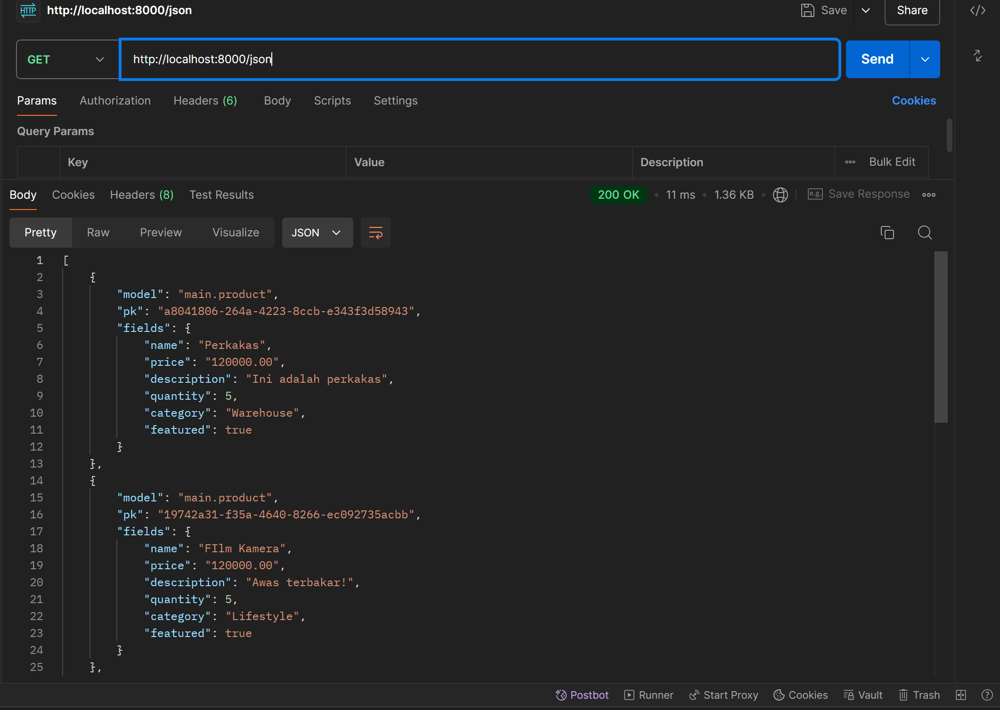

# Morehub

## [Visit Morehub Right Now!](http://krisna-putra-morehub.pbp.cs.ui.ac.id/)

### Morehub.com, a Platform-Based Programming project, made by:
- Nama: Krisna Putra Purnomo
- NPM: 2306228756
- Kelas: PBP E

### Redirect 
- [Tugas 2](#pertanyaan-tugas-2)
- [Tugas 3](#pertanyaan-tugas-3)
- [Tugas 4](#pertanyaan-tugas-4)

### Pertanyaan Tugas 2

1. Jelaskan bagaimana cara kamu mengimplementasikan _checklist_ di atas secara _step-by-step_ (bukan hanya sekadar mengikuti tutorial).

    **JAWAB**:

    a. Pastikan setup telah selesai disiapkan, termasuk django telah terinstall, dan _virtual environment_ dapat berjalan dengan baik.

    b. Pertama-tama, saya membuat requirements.txt yang berisi dependencies proyek Django yang akan saya buat, berdasarkan dependencies pada sesi tutorial.

    c. Jika sekiranya tidak ada masalah, selanjutnya saya membuat proyek Django dengan perintah `django-admin startproject Morehub .` dimana Morehub adalah nama aplikasi e-dagang saya.

    d. Selanjutnya, saya membuat aplikasi `main` dengan menggunakan perintah `python manage.py startapp main`.

    e. Saat aplikasi `main` sudah dibuat, saya membuat model `Product`  di `models.py` pada folder `main` dengan atribut sebagai berikut: 

    ```python
        from django.db import models

        class Product(models.Model):
            name = models.TextField()
            price = models.DecimalField(max_digits=10, decimal_places=2)
            description = models.TextField()
            quantity = models.IntegerField()
            category = models.CharField(max_length=100)
            featured = models.BooleanField()
    ```
    Namun, saat masa Tugas 2 ini, atribut model di atas masih _subject to change_, karena proyeknya belum dikerjakan. Namun, saya sudah melakukan migrasi model ke dalam basis data lokal.

    f. Setelah itu, buat folder baru di dalam aplikasi `main` bernama `templates` berisi `main.html` yang dapat menampilkan data dari model `Product`.

    g. Kemudian, saya mengintegrasikan komponen MVT dengan membuat fungsi `show_main` di `views.py` yang akan mengembalikan _response_ berupa _template_ HTML yang menampilkan nama aplikasi dan nama serta kelas saya.

    ```python
        from django.shortcuts import render

        def show_main(request):
            context = {
                'name': 'Film kamera analog',
                'price': '120000',
                'description': 'awas terbakar',
                'quantity': '10',
                'category': 'Lifestyle',
                'featured': True
            }

            return render(request, "main.html", context)
    ```

    h. Setelah itu, saya membuat routing URL aplikasi `main` untuk mengatur rute URL spesifik untuk fitur-fitur dalam aplikasi tersebut. 

    ```python
        from django.urls import path
        from main.views import show_main

        app_name = 'main'

        urlpatterns = [
            path('', show_main, name='show_main'),
        ]
    ```

    i. Kemudian, saya membuat routing di tingkat proyek agar proyek saya dapat menjalankan aplikasi `main` dengan menambahkan path `/`ke `urls.py` proyek.

    ```python
        from django.contrib import admin
        from django.urls import path, include

        urlpatterns = [
            path('', include('main.urls')),
            path('admin/', admin.site.urls),
        ]
    ```

2. Buatlah bagan yang berisi request client ke web aplikasi berbasis Django beserta responnya dan jelaskan pada bagan tersebut kaitan antara `urls.py`, `views.py`, `models.py`, dan berkas `html`.

    **JAWAB**:

    

    a. Client mengirimkan _request_ halaman utama ke browser yang diarahkan kepada URL routing (`urls.py`) yang berada di tingkat proyek.

    b. _Request_ tersebut diterima dan kemudian fungsi show_main() di `views.py` dipanggil.

    c. Setelah itu, fungsi show_main() yang sudah memiliki pre-defined model (context), dapat berinteraksi dengan ORM maupun basis data (melakukan operasi _read_/_write_) untuk mengakses/mengubah data yang nantinya akan ditampilkan. Namun, pada saat ini saya mengerjakan tugas ini, belum ada implementasi ORM/basis data.

    d. Kemudian, pemanggilan fungsi show_main() pada `views.py` yang sudah berisi data akan diteruskan ke `templates/main.html`. 

    e. Jika tidak terjadi error, `main.html` akan dikirim kembali ke browser sebagai _response_ sebagai halaman utama yang di-_request_ client.

    f. Halaman utama yang sudah berisi `main.html` ditampilkan di browser Client.

3. Jelaskan fungsi `git` dalam pengembangan perangkat lunak!

    **JAWAB**:

    a. **Version Control**:
    Git melacak setiap perubahan kode, sehingga memungkinkan developer riwayat versi pengembangan dan memungkinkan untuk beralih ke versi sebelumnya, contohnya menggunakan command `commit`, `reset`, dan `checkout`.

    b. **Collaboration**:
    Git memungkinkan kolaborasi antar developer yang bekerja pada suatu projek yang sama. Dengan `branching` dan `merging`, para developer dapat bekerjasama tanpa mengganggu pekerjaan satu sama lain.

    c. **Deployment**:
    Git memungkinkan developer untuk melakukan _deployment_ ke _production server_ secara mudah melalui command `push` untuk mengirim versi terbaru dan `pull` untuk menerima versi terbaru.

4. Menurut Anda, dari semua framework yang ada, mengapa framework Django dijadikan permulaan pembelajaran pengembangan perangkat lunak?

    **JAWAB**:

    a. **_Built-in Features_**:
    Dengan fitur bawaan yang _beginner-friendly_ seperti pengelolaan basis data menggunakan ORM, pemula diharapkan dapat lebih mudah memahami konsep dasar pengembangan perangkat lunak. Bahkan, django juga memiliki fitur keamanan bawaan yang dapat mencegah serangan siber seperti SQL Injection dan MitM. Namun, _developer_ tetap harus mempelajari dan mengimplementasikan keamanan siber lebih lanjut untuk membuat proyek yang lebih serius.

    b. **Struktur**:
    Pola MVT (Model-View-Template) yang dengan jelas memisahkan logika _back-end_ dan _front-end_, memudahkan pemula untuk memahami organisasi dan struktur web, serta membantu pemula dalam pengembangan web yang lebih kompleks.
    
    c. **Skalabilitas**:
    Kebanyakan proyek yang menggunakan django merupakan proyek web besar dan kompleks yang berkelanjutan. Django dirancang sedemikian rupa sehingga proses CI/CD dapat dilakukan dengan mudah. Dengan demikian, pemula juga dapat belajar cara me-_maintain_ suatu perangkat lunak yang terus berkembang dan berkelanjutan.

    d. **_Built-in_ ORM**:
    Django secara otomatis memberikan API abstraksi basis data (ORM) yang memungkinkan user untuk membuat, menerima, mengupdate, dan menghapus objek. Dengan demikian, pemula tidak perlu berhadapan langsung dengan _raw_ SQL. 

5. Mengapa model pada Django disebut sebagai _ORM_?

    **JAWAB**:

    Model pada Django disebut ORM karena mereka menghubungkan struktur objek dalam kode python dengan tabel-tabel dalam database relasional, seperti halnya pada SQL.

### Pertanyaan Tugas 3

1. Jelaskan mengapa kita memerlukan _data delivery_ dalam pengimplementasian sebuah platform?

    **JAWAB**:

    _Data delivery_ dibutuhkan ketika kita ingin mengirimkan data dari satu _stack_ ke _stack_ lainnya. Hal tersebut sangat krusial di banyak aplikasi web modern yang membutuhkan _update_ data secara _real-time_. Selain itu, _data delivery_ yang efisien merupakan salah kunci dalam performa UX (_User Experience_). _Data delivery_ yang baik membuat _user_ menerima konten dengan cepat dan responsif, menciptakan pengalaman yang lebih baik dan menarik bagi _user_. Sebaliknya, _data delivery_ yang buruk dapat membuat waktu _loading_ menjadi lambat dan dapat membuat _user_ kesal.

2. Menurutmu, mana yang lebih baik antara XML dan JSON? Mengapa JSON lebih populer dibandingkan XML?

    **JAWAB**:

    Menurut saya, JSON lebih baik dari XML. Misalnya, dari segi sintaks, JSON lebih pendek dan simpel. Selain itu, JSON dapat di-_parse_ menggunakan fungsi JavaScript biasa, sedangkan XML harus di-_parse_ menggunakan XML _parser_. Alasan JSON lebih populer di dunia _web development_ dibandingkan XML adalah karena JSON banyak digunakan untuk pertukaran data, khususnya bersama JavaScript asinkronus (AJAX) dan REST API, teknik pemrograman dan API yang paling umum digunakan.

3. Jelaskan fungsi dari method `is_valid()` pada form Django dan mengapa kita membutuhkan method tersebut?

    **JAWAB**:

    Fungsi `form.is_valid()` pada Django berfungsi untuk memvalidasi input, berdasarkan tipe data (Misal IntegerField, TextField), _constraints_ (Misal, required=True, max_length), atau _custom validator_. Method ini akan mengembalikan nilai Boolean, yang berfungsi sebagai _error handler_ yang akan me-_return_ False jika validasi gagal dan menampilkan atribut `form.errors`, dan mengembalikan True jika semua validasi berhasil.

4. Mengapa kita membutuhkan `csrf_token` saat membuat form di Django? Apa yang dapat terjadi jika kita tidak menambahkan `csrf_token` pada form Django? Bagaimana hal tersebut dapat dimanfaatkan oleh penyerang?

    **JAWAB**:

    Kita membutuhkan `csrf_token` untuk memberi perlindungan terhadap serangan siber bertipe CSRF (Cross-Site Request Forgery), dimana penyerang mencoba memaksa _user_ yang telah login untuk mengirimkan _request_ yang tidak diinginkan ke aplikasi web tanpa sepengetahuan mereka. Jika kita tidak menambahkan token tersebut pada form Django, aplikasi web kita rentan terhadap serangan CSRF. Penyerang dapat membuat pengguna secara tidak sadar melakukan tindakan berbahaya, seperti mengubah kata sandi, melakukan transfer dana, dan tindakan lainnya hanya dengan mengunjungi situs berbahaya. Hal tersebut dapat dimanfaatkan oleh penyerang dengan mengirimkan permintaan ke aplikasi Django di mana pengguna sudah login. Contohnya, saat _user_ sedang login di aplikasi bank online, lalu membuka halaman berbahaya di tab lain, halaman tersebut bisa mengirim permintaan POST ke aplikasi bank untuk mentransfer uang ke rekening penyerang, karena cookie sesi pengguna akan otomatis dikirim bersama permintaan. Tanpa `csrf_token`, _server_ tidak bisa mendeteksi bahwa permintaan tersebut tidak berasal dari pengguna.

5. Jelaskan bagaimana cara kamu mengimplementasikan _checklist_ di atas secara _step-by-step_ (bukan hanya sekadar mengikuti tutorial).

    **JAWAB**:

    a. Setelah membuat template dasar `base.html` di _root_ folder dan mengubah _Primary Key_ dari Integer menjadi UUID untuk menangani **IDOR** _vulnerability_, saya membuat file `forms.py` pada direktori `main` yang nantinya akan menjadi struktur form yang menerima produk baru.

    ```python
        from django.forms import ModelForm
        from main.models import Product

        class ProductForm(ModelForm):
            class Meta:
                model = Product
                fields = ['name', 'price', 'description', 'quantity', 'category', 'featured']
    ```

    b. Kemudian, saya menambahkan _import_ `redirect` dari `django.shortcuts` pada `views.py` dan tentunya saya juga meng-_import_  `ProductForm` dari `forms.py`.

    c. Masih di file `views.py`, saya menambahkan fungsi dengan parameter `request` baru untuk mengirim _form_ dan menambahkan `Product` jika _form_ yang diisi valid (dicek dengan method `is_valid()`) melalui `request.POST`.

    ```python
        def create_product(request):
        form = ProductForm(request.POST or None)

        if form.is_valid():
            form.save()
            return redirect('main:show_main')
        
        context = {'form': form}
        return render(request, 'create_product.html', context)
    ```

    d. Setelah itu, pada fungsi `show_main()` di `views.py`, saya menambahkan fungsi `Product.objects.all()` yang di-_assign_ ke `products` untuk mengambil seluruh objek `Product` dari basis data.

    ```python
        def show_main(request):
        products = Product.objects.all()
        context = {
            'name': 'Panci',
            'price': '5000',
            'description': 'Panci buat mentung orang',
            'quantity': '10',
            'category': 'Dapur',
            'featured': True,
            'products': products
        }

        return render(request, "main.html", context)
    ```
    Objek yang saya buat di atas hanya contoh.

    e. Kemudian, saya meng-_import_ fungsi `create_product` ke `urls.py` agar saya dapat menambahkannya ke `urlpatterns`.

    f. Setelah itu, saya membuat file HTML baru `create_product.html` sebagai template form yang akan mengirim _request_ ke _view_ `create_product(request)`. Saya juga menampilkan data `product` dalam bentuk tabel dan tombol "Add Product" yang akan _redirect_ ke halaman _form_.

    g. Kemudian, saya akan membuat empat buah fungsi pada `views.py` di `main` yang masing-masing akan mengembalikan data dalam bentuk JSON, XML, JSON berdasarkan ID, dan XML berdasarkan ID. Namun sebelum itu, saya harus menambahkan _import_ `HttpResponse` untuk merespon HTTP dan `Serializer` untuk menerjemahkan objek model menjadi format lain (XML dan JSON).

    h. Setelah itu, saya membuat masing-masing fungsi yang akan mengembalikan data sesuai yang saya jelaskan pada langkah sebelumnya.

    ```python 
        def show_xml(request):
        data = Product.objects.all()
        return HttpResponse(serializers.serialize("xml", data), content_type="application/xml")

        def show_json(request):
            data = Product.objects.all()
            return HttpResponse(serializers.serialize("json", data), content_type="application/json")

        def show_xml_by_id(request, id):
            data = Product.objects.filter(pk=id)
            return HttpResponse(serializers.serialize("xml", data), content_type="application/xml")

        def show_json_by_id(request, id):
            data = Product.objects.filter(pk=id)
            return HttpResponse(serializers.serialize("json", data), content_type="application/json")
    ```

    Perhatikan bahwa `content_type` disesuaikan dengan bentuk data yang akan dikembalikan.

    i. Kemudian, saya membuat _routing_ URL untuk masing-masing `views` yang telah saya tambahkan pada langkah sebelumnya. _Routing_ tersebut dikelola pada `urls.py` di `main`, yang akan meng-_handle_ semua pola URL yang akan mengembalikan data yang diinginkan.

    ```python
        from django.urls import path
        from main.views import show_main, create_product, show_xml, show_json, show_xml_by_id, show_json_by_id

        app_name = 'main'

        urlpatterns = [
            path('', show_main, name='show_main'),
            path('create-product', create_product, name='create_product'),
            path('xml/', show_xml, name='show_xml'),
            path('json/', show_json, name='show_json'),
            path('xml/<str:id>', show_xml_by_id, name='show_xml_by_id'),
            path('json/<str:id>', show_json_by_id, name='show_json_by_id'),
        ]
    ```

    Perhatikan bahwa saya meng-_import_ terlebih dahulu semua fungsi yang berada di `views.py` untuk dapat melakukan _call_ pada setiap pola URL yang didefinisikan.

6.  Mengakses keempat URL di poin 2 menggunakan Postman, membuat _screenshot_ dari hasil akses URL pada Postman, dan menambahkannya ke dalam `README.md`.

    a. `show_xml()`

    

    b. `show_json()`

    

    c. `show_xml_by_id()`

    

    d. `show_json_by_id`

    


### Pertanyaan Tugas 4

1. Apa perbedaan antara `HttpResponseRedirect()` dan `redirect()`

    **JAWAB**:

    Fungsi `HttpResponseRedirect()` berfungsi untuk me-_return_ status HTTP 302, yang menunjukkan bahwa browser harus mengarahkan ulang ke URL yang diberikan. Parameter fungsinya dapat berupa URL tujuan secara langsung, ataupun _reference_ dari URL _view name_ atau bahkan _model instance_ menggunakan method reverse() seperti yang diajarkan di tutorial untuk menghindari _hardcoding_, karena django menggunakan sistem _named URL routing_. Di sisi lain, fungsi `redirect()` lebih fleksibel karena selain dapat menerima URL secara langsung, fungsi ini bisa menerima _view name_ atau sebuah _model instance_. Django akan otomatis mengonversi view name dan model instance menjadi URL. 

2. Jelaskan cara kerja penghubungan model `Product` dengan `User`!

    **JAWAB**:

    Pertama, import `User` pada `models.py` untuk keperluan autorisasi model. Kemudian pada class model yang dibuat, hubungkan satu objek model (dalam hal ini `Product`) dengan satu user menggunakan ForeignKey. Dengan demikian, sebuah Product sekarang sudah terasosisasikan dengan seorang user. Namun, method untuk membuat objek (`Product`) pada `views.py` juga harus di-_adjust_ agar hanya user yang terautorisasi yang bersangkutan yang hanya dapat membuat objek baru.

3. Apa perbedaan antara _authentication_ dan _authorization_, apakah yang dilakukan saat pengguna login? Jelaskan bagaimana Django mengimplementasikan kedua konsep tersebut.

    **JAWAB**:

    _Authentication_ adalah proses verifikasi data pengguna, sedangkan _authorization_ adalah proses untuk memeriksa hak akses pengguna setelah mereka terautentikasi. Saat pengguna login dan memasukkan kredensial, sistem akan mencocokkan kredensial tersebut dengan yang terdapat di basis data. Jika sesuai, sistem akan melakukan proses _authorization_ untuk memastikan apakah pengguna tersebut diizinkan untuk mengakses halaman atau melakukan tindakan tertentu. Implementasi _authentication_ di django menggunakan model `User` bawaan di `django.contrib.auth.models.User` yang menyimpan kredensial pengguna seperti Username dan Password. Ketika pengguna login menggunakan view, django akan memverifikasi kredensial pengguna menggunakan `AuthenticationForm`. Jika valid, django akan menginisiasi _session_ untuk pengguna. Setelah itu, objek user dapat login untuk menyimpan informasi pengguna dalam session, sehingga Django tahu bahwa pengguna ini terautentikasi pada permintaan-permintaan berikutnya. Di sisi lain, untuk implementasi _authorization_, django menggunakan sistem _permissions_ sehingga setiap pengguna memiliki izin bawaan seperti "add", "change", dan "delete" objek. Izin-izin ini dapat diperluas sesuai dengan kebutuhan aplikasi. Selain itu, django juga memiliki beberapa decorator seperti `@login_required` untuk membatasi akses hanya pada pengguna yang terautentikasi, dan `@permission_required` untuk melakukan pengecekan izin spesifik untuk setiap view atau tindakan.

4. Bagaimana Django mengingat pengguna yang telah login? Jelaskan kegunaan lain dari _cookies_ dan apakah semua _cookies_ aman digunakan?

    **JAWAB**:

    Saat pengguna berhasil login, Django membuat session yang disimpan di server, dan memberikan pengguna tersebut sebuah _session cookie_ yang berisi _session ID_. _Session ID_ inilah yang nantinya akan dikirim bersama _request_ pengguna selanjutnya, sehingga _server_ bisa  mengaitkan _request_ tersebut dengan sesi pengguna yang tersimpan di _server_, sehingga pengguna tidak perlu login lagi. Kegunaan lain _cookies_ misalnya untuk menyimpan preferensi pengguna, contohnya  jika pengguna memilih _dark mode_ di suatu situs web, _cookie_ dapat menyimpan informasi ini sehingga pada kunjungan berikutnya situs tetap tampil dalam _dark mode_. Selain itu, _cookies_ juga sering digunakan oleh *Google Analytics* dan _personalized ad_ untuk memungkinkan iklan ditargetkan berdasarkan pelacakan aktivitas pengguna. Terakhir, tidak semua _cookies_ aman digunakan. Hal ini karena cookies dapat disalahgunakan untuk menyimpan informasi sensitif seperti password atau data pribadi yang berisiko tinggi diambil oleh pihak yang tidak berwenang, misalnya _hacker_. Namun, django menyediakan beberapa flag bawaan yang dapat meminimalisir kemungkinan tersebut seperti `Secure`, `HttpOnly`, dan `SameSite`. Selain itu, cookies untuk sesi login sebaiknya memiliki waktu kedaluwarsa yang wajar (tidak terlalu lama) untuk mencegah risiko keamanan.

5. Jelaskan bagaimana cara kamu mengimplementasikan _checklist_ di atas secara _step-by-step_ (bukan hanya sekadar mengikuti tutorial).

    **JAWAB**:

    a. Pertama, pada `views.py` saya menambahkan import dari `django.contrib.auth.forms`, `django.contrib`, dan `django.contrib.auth` untuk kepentingan pembuatan form dan fungsi login dan logout yang akan saya buat.

    ```python
        from django.contrib.auth.forms import UserCreationForm, AuthenticationForm
        from django.contrib import messages
        from django.contrib.auth import authenticate, login, logout
    ```

    b. Masih di file yang sama, saya menambahkan fungsi `register()` seperti berikut

    ```python
        def register(request):
            form = UserCreationForm()

            if request.method == "POST":
                form = UserCreationForm(request.POST)
                if form.is_valid():
                    form.save()
                    messages.success(request, 'Your account has been successfully created!')
                    return redirect('main:login')
            context = {'form':form}
            return render(request, 'register.html', context)
    ```

    Fungsi tersebut digunakan untuk menghasilkan form registrasi secara otomatis dan menghasilkan akun pengguna ketika data di-_submit_ dari form.

    c. Setelah itu, saya membuat file `register.html` yang akan menampilkan form registrasi kepada pengguna yang akan mendaftar.

    d. Setelah itu, kembali ke `views.py`, saya menambahkan import sebagai berikut

    ```python
        import datetime
        from django.http import HttpResponseRedirect
        from django.urls import reverse
    ```

    Import tersebut berguna untuk keperluan penerapan _cookies_.
            
    e. Kemudian, saya menambahkan fungsi `login_user()` yang berfungsi untuk mengautentikasi pengguna yang ingin login. ```python
        def login_user(request):
            if request.method == 'POST':
                form = AuthenticationForm(data=request.POST)

                if form.is_valid():
                    user = form.get_user()
                    login(request, user)
                    response = HttpResponseRedirect(reverse("main:show_main"))
                    response.set_cookie('last_login', str(datetime.datetime.now()))
                    return response

            else:
                form = AuthenticationForm(request)
            context = {'form': form}
            return render(request, 'login.html', context)
    ```

    Fungsi tersebut sudah menerapkan _cookies_ yang akan melihat dan menyimpan kapan terakhir kali pengguna login.

    f. Setelah itu, saya menambahkan potongan kode `'last_login': request.COOKIES['last_login']` ke dalam variabel `context` pada fungsi `show_main(). Potongan kode tersebut-lah yang akan menampilkan kapan terakhir kali pengguna login. Tampilkan sesi terakhir login dengan menampilkan `last_login` di file `main.html`.

    g. Kemudian, saya membuat file `login.html` di `main/templates` sebagai form login akun.

    h. Setelah itu, saya membuat fungsi baru di `views.py` yang berfungsi untuk logout. 

    ```python
        def logout_user(request):
            logout(request)
            response = HttpResponseRedirect(reverse('main:login'))
            response.delete_cookie('last_login')
            return response
    ```

    Jangan lupa untuk menambahkan tombol logout di `main.html` yang mengimplementasikan fungsi logout yang baru saja dibuat.

    i. Kemudian, buka `urls.py`, import semua fungsi yang telah kita buat dan tambahkan semua _path url_ fungsi tersebut ke `urlpatterns`. Sekarang `urlpatterns` saya seperti ini

    ```python
        urlpatterns = [
            path('', show_main, name='show_main'),
            path('create-product', create_product, name='create_product'),
            path('xml/', show_xml, name='show_xml'),
            path('json/', show_json, name='show_json'),
            path('xml/<str:id>', show_xml_by_id, name='show_xml_by_id'),
            path('json/<str:id>', show_json_by_id, name='show_json_by_id'),
            path('register/', register, name='register'),
            path('login/', login_user, name='login'),
            path('logout/', logout_user, name='logout')
        ]
    ```

    j. Terakhir, saya akan kembali ke `views.py` untuk mengimplementasikan _authorization_ agar hanya pengguna yang telah login yang dapat mengakses halaman `main`. Impor _decorator_ `login_required` dari `django.contrib.auth.decorators` dan tambahkan _decorator_ tersebut diatas fungsi `show_main()`.

    k. Untuk menghubungkan `Product` dengan `User`,  saya menambah import `from django.contrib.auth.models import User` pada `models.py`, kemudian menambahkan potongan kode `user = models.ForeignKey(User, on_delete=models.CASCADE)` pada model saya. Untuk cara kerjanya sudah saya jelaskan pada jawaban soal nomor 2.

    l. Setelah itu, saya berpindah ke `views.py` untuk mengubah fungsi `create_product()` menjadi sedemikian rupa

    ```python
        def create_product(request):
            form = ProductForm(request.POST or None)

            if form.is_valid() and request.method == "POST":
                mood_entry = form.save(commit=False)
                mood_entry.user = request.user
                mood_entry.save()
                return redirect('main:show_main')
            
            context = {'form': form}
            return render(request, 'create_product.html', context)
    ```

    m. Setelah itu, saya menampilkan username pengguna yang login pada halaman main dengan mengubah variabel `context` pada fungsi `show_main()` sedemikian rupa

    ```python
        @login_required(login_url='/login')
        def show_main(request):
            products = Product.objects.filter(user=request.user)
            context = {
                'my_name': 'Krisna Putra Purnomo',
                'NPM': '2306228756',
                'class': 'E',
                'name': request.user.username,
                'title': 'Keeps you coming for more!',
                'products': products,
                'last_login': request.COOKIES['last_login']
            }

            return render(request, "main.html", context)
    ```

    n. Setelah menyesuaikan file `main.html` untuk menampilkan nama user yang sedang login, saya melakukan migrasi model dan menetapkan _default value_ untuk _field user_ pada semua baris yang telah dibuat pada basis data.

    o. Terakhir, saya mengikuti tutorial dengan memisahkan _environment production_ dengan menyesuaikan variabel `DEBUG` di `settings.py`.


