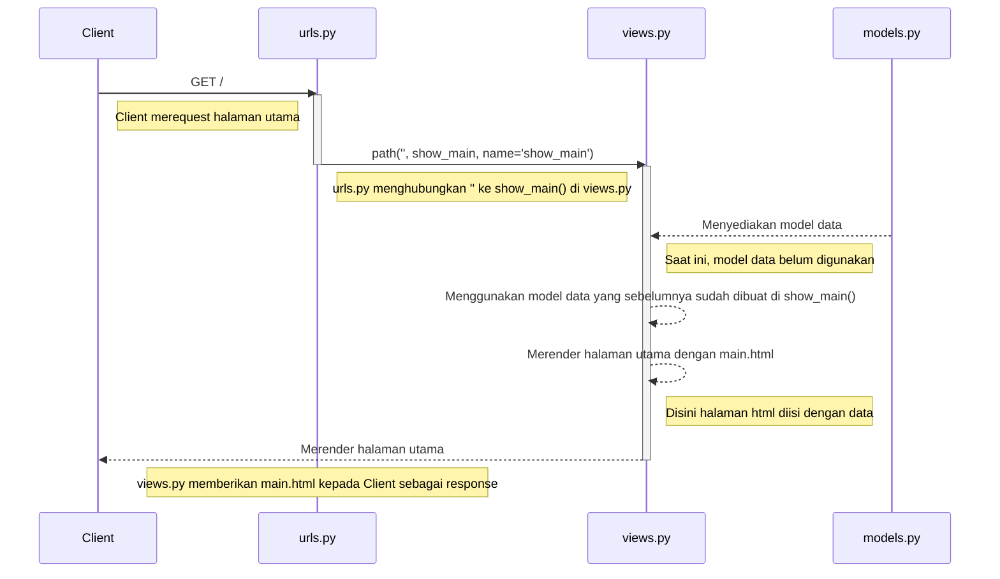

```mermaid

sequenceDiagram
    participant Client
    participant urls.py
    participant views.py
    participant models.py

    Client->>urls.py: GET /
    activate urls.py

    Note right of Client: Client merequest halaman utama

    urls.py->>views.py: path('', show_main, name='show_main')
    deactivate urls.py
    activate views.py

    Note right of urls.py: urls.py menghubungkan '' ke show_main() di views.py

    models.py-->>views.py: Menyediakan model data

    Note left of models.py: Saat ini, model data belum digunakan

    views.py-->>views.py: Menggunakan model data yang sebelumnya sudah dibuat di show_main()

    views.py-->>views.py: Merender halaman utama dengan main.html

    Note right of views.py: Disini halaman html diisi dengan data

    views.py-->>Client: Merender halaman utama
    deactivate views.py

    Note over urls.py: views.py memberikan main.html kepada Client sebagai response 
```